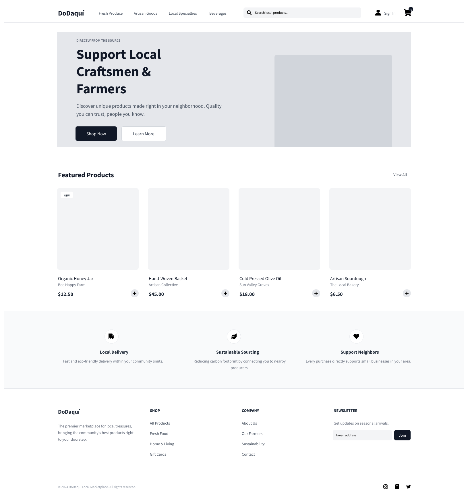
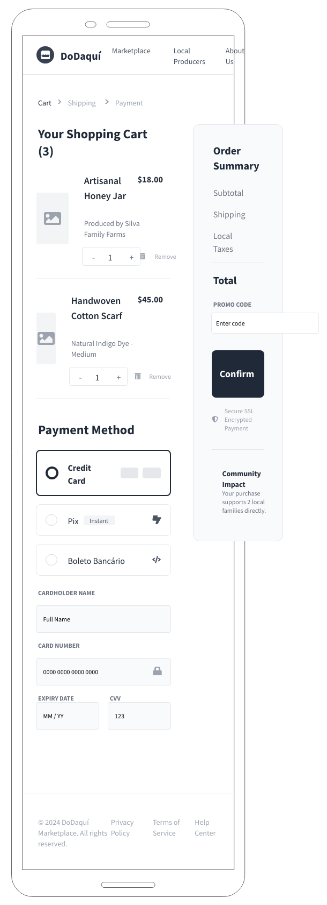

# Deseño

Este documento recolle o deseño de interface e o deseño de base de datos do proxecto.

## Deseño de interface de usuarios

### Esquema (boceto ou wireframe) para pantalla de ordenador

- [Ver ficheiro do wireframe de ordenador](../img/Page_1.png)

### Esquema (boceto ou wireframe) para móbil

- [Ver ficheiro do wireframe de móbil](../img/Page_2.png)

## Identidade visual

### Paleta de cores

As cores principais da paleta son:

- `#F8F9FA`
- `#E9ECEF`
- `#DEE2E6`
- `#ADB5BD`
- `#6C757D`
- `#495057`
- `#343A40`

Uso recomendado na interface:

- `#F8F9FA`, `#E9ECEF` e `#DEE2E6` para fondos e superficies principais.
- `#ADB5BD` para liñas divisorias e elementos secundarios.
- `#6C757D` para texto secundario e estados neutros.
- `#495057` e `#343A40` para texto principal e títulos, garantindo bo contraste.

### Tipografía

Proponse unha tipografía sans-serif limpa e lexible:

- Títulos e chamadas principais: `Montserrat` (peso semibold/bold).
- Texto corrido e elementos de interface: `Open Sans` (peso regular/medium).

Esta combinación busca unha identidade visual moderna, clara e coherente en móbil e escritorio.

## Deseño de Base de Datos

Diagrama ER en formato Mermaid (almacenado no cartafol de imaxes/documentación):

- [Diagrama da base de datos](../img/diagrama_bd.png)

